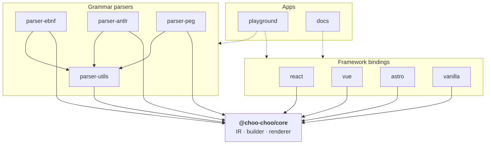

# Architecture

This document is the target architecture of choo-choo. It reflects intent — pieces are materialised as the roadmap advances.

## Package graph

- Every package depends on `@choo-choo/core` (directly or via `parser-utils`).
- Parsers depend on `parser-utils` for lexer primitives and on `core` for IR construction.
- Framework bindings depend only on `core`. They do **not** depend on any parser — consumers choose which parser to import.

## Intermediate Representation (IR)

The IR is a **flat discriminated union** of `Node` kinds — pure data, no methods, no SVG awareness. It is the only contract shared between parsers and the renderer.

Planned node kinds:

| Kind          | Purpose                                                                 |
|---------------|-------------------------------------------------------------------------|
| `diagram`     | Root container for a single railroad diagram.                           |
| `start`       | Entry marker.                                                           |
| `end`         | Exit marker.                                                            |
| `terminal`    | Literal token (quoted string, keyword).                                 |
| `nonterminal` | Reference to another rule.                                              |
| `special`     | Opaque token rendered with a distinctive style (e.g. EBNF `?…?`).       |
| `comment`     | Inline comment annotation.                                              |
| `sequence`    | Left-to-right concatenation of children.                                |
| `choice`      | Vertical branch — pick one of N children.                               |
| `optional`    | Child can be skipped.                                                   |
| `repetition`  | One-or-more / zero-or-more over a child, optionally with a separator.   |
| `group`       | Labelled boxing container (no structural effect).                       |
| `skip`        | Explicit empty path (used by `optional` / `choice`).                    |

The exact shape of each node is specified in `docs/ir.md` when milestone M1 lands.

## Grammar parsers

Every grammar parser implements a single interface exported from `@choo-choo/core`:

- `id` — a short identifier (`"ebnf"`, `"antlr"`, `"peg"`, …) used by bindings and the playground.
- `parse(source: string): ParsedGrammar` — consumes a grammar source and returns an ordered list of named `GrammarRule` values. Each rule carries a `Diagram` IR tree, its name, and an optional `SourceRange` pointing back at the rule's definition in the source.

Parsers are **standalone packages**. Adding a new grammar (ABNF, classic BNF, …) requires no changes to `core` or to any binding.

Shared lexer primitives — reader, tokenizer, regex-based specification table — live in `@choo-choo/parser-utils` so each grammar package is not forced to reinvent them. The three launch parsers share enough lexical structure to reuse those primitives but diverge where it matters:

- **EBNF** follows ISO/IEC 14977: explicit `{ }` / `[ ]` for repetition and optionality, `=` for definitions, `|` for alternation.
- **ANTLR** uses `:` / `;` rule delimiters, `?` / `*` / `+` cardinalities, rule labels, and token vs parser rule conventions.
- **PEG** adds ordered-choice semantics (first match wins) and lookahead predicates (`&`, `!`) that change how alternatives are interpreted — a semantic difference, not just surface syntax.

## Renderer

- **Input**: a `diagram` IR node.
- **Output**: an SVG string.
- **Strategy**: a visitor dispatching on `node.kind`. Layout is computed top-down (width, height, up, down — mirroring the legacy project's geometry) and emitted as SVG strings. No DOM APIs are called.
- **SSR**: guaranteed — the renderer is pure and deterministic.
- **Styling**: an optional stylesheet (`railroad.css`) ships with `core`; every binding re-exports it so consumers opt in with a single import.

The renderer's surface is specified in `docs/rendering.md` when milestone M1 lands.

## Bindings

All bindings share one prop shape:

- `source?: string` + `parser?: GrammarParser` — grammar-driven path.
- `ir?: Node` — already-built IR tree (from the manual builder or a custom source).
- Exactly one of the two must be provided.

Binding-specific behaviour:

- **`@choo-choo/react`** — functional component using `dangerouslySetInnerHTML`. Works in both server and client components; no `"use client"` directive required.
- **`@choo-choo/vue`** — Vue 3 single-file component using `v-html`.
- **`@choo-choo/astro`** — `.astro` component; renders at build time by default (zero client JS).
- **`@choo-choo/vanilla`** — exposes (a) an imperative `mount(element, options)` and (b) a `<choo-choo>` custom element. The grammar parser is dynamically imported based on a `grammar` attribute / option so the baseline bundle stays small.

Each binding's exact prop/attribute API is specified under `docs/bindings/*.md` when its milestone lands.

## Architectural decisions

### Visitor pattern for rendering, not methods on AST nodes

The legacy project attached a `toDiagram()` method to every AST node, coupling the AST to the renderer and forcing every parser to know how to render. The new design keeps IR nodes as pure data and places rendering behind a visitor. As a result, parsers can be implemented, tested, and shipped independently from the renderer.

### Monorepo (pnpm workspaces)

Four framework bindings plus two — and counting — parsers plus core would be painful in a single package: consumers of the React binding would pull in every other binding, and we'd have to manage peer dependencies for React, Vue, and Astro simultaneously. A monorepo lets each package declare only what it needs and lets consumers import only what they use.

### `@choo-choo/core` has no runtime dependencies

`core` is on every consumer's hot path. Zero runtime dependencies keeps bundle sizes predictable and side-effects auditable.

### Bindings do not bundle parsers

Most consumers only use one grammar. Bundling all parsers into every binding would be wasteful. Parsers are separate packages that consumers import explicitly.
