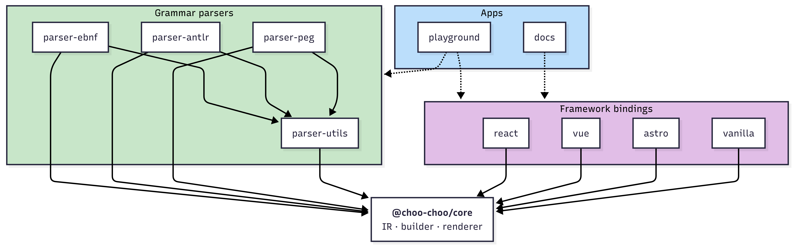

## Package graph

- Every package depends on `@choo-choo/core` (directly or via `parser-utils`).
- Parsers depend on `parser-utils` for lexer primitives and on `core` for IR construction.
- Framework bindings depend only on `core`. They do not depend on any parser.
  - Consumers choose which parser to import.

## Intermediate representation

The intermediate representation (IR) is a flat discriminated union of `Node` kinds. It's pure data, without methods, or SVG awareness. It is the only contract shared between parsers and the renderer. The exact shape of each node is specified in [IR](ir.md).

## Grammar parsers

Every grammar parser implements a single interface exported from `@choo-choo/core`:

- `id` — a short identifier (`ebnf`, `antlr` or `peg`) used by bindings and the playground.
- `parse(source: string): ParsedGrammar` — consumes a grammar source and returns an ordered list of named `GrammarRule` values. Each rule carries a `Diagram` IR tree, its name, and an optional `SourceRange` pointing back at the rule's definition in the source.

Parsers are **standalone packages**. Adding a new grammar (ABNF, classic BNF, …) requires no changes to `core` or to any binding.

Shared lexer primitives — reader, tokenizer, regex-based specification table — live in `@choo-choo/parser-utils` so each grammar package is not forced to reinvent them. The three launch parsers share enough lexical structure to reuse those primitives but diverge where it matters:

- **EBNF** follows ISO/IEC 14977: explicit `{ }` / `[ ]` for repetition and optionality, `=` for definitions, `|` for alternation.
- **ANTLR** uses `:` / `;` rule delimiters, `?` / `*` / `+` cardinalities, rule labels, and token vs parser rule conventions.
- **PEG** adds ordered-choice semantics (first match wins) and lookahead predicates (`&`, `!`) that change how alternatives are interpreted — a semantic difference, not just surface syntax.

## Renderer

- **Input**: a `diagram` IR node.
- **Output**: an SVG string.
- **Strategy**: a visitor dispatching on `node.kind`. Layout is computed top-down (width, height, up, down — mirroring the legacy project's geometry) and emitted as SVG strings. No DOM APIs are called.
- **SSR**: guaranteed — the renderer is pure and deterministic.
- **Styling**: an optional stylesheet (`railroad.css`) ships with `core`; every binding re-exports it so consumers opt in with a single import.

The renderer's surface is specified in `docs/rendering.md` when milestone M1 lands.

## Bindings

All bindings share one prop shape:

- `source?: string` + `parser?: GrammarParser` — grammar-driven path.
- `ir?: Node` — already-built IR tree (from the manual builder or a custom source).
- Exactly one of the two must be provided.

Binding-specific behaviour:

- **`@choo-choo/react`** — functional component using `dangerouslySetInnerHTML`. Works in both server and client components; no `"use client"` directive required.
- **`@choo-choo/vue`** — Vue 3 single-file component using `v-html`.
- **`@choo-choo/astro`** — `.astro` component; renders at build time by default (zero client JS).
- **`@choo-choo/vanilla`** — exposes (a) an imperative `mount(element, options)` and (b) a `<choo-choo>` custom element. The grammar parser is dynamically imported based on a `grammar` attribute / option so the baseline bundle stays small.

Each binding's exact prop/attribute API is specified under `docs/bindings/*.md` when its milestone lands.
