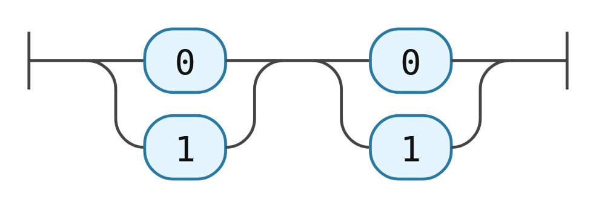

If you haven't already, follow [Hello world](./hello-world.md) first to set up `package.json`, `index.html` and Vite. We'll now add one extra dependency and a different `main.ts`.

## Install the parser

```sh
pnpm add @choo-choo/parser-ebnf
```

## Replace `src/main.ts`

```ts
import "@choo-choo/vanilla/styles.css";
import { mount } from "@choo-choo/vanilla";
import { ebnfParser } from "@choo-choo/parser-ebnf";

mount(document.getElementById("diagram")!, {
  source: `
    digit = "0" | "1" ;
    pair  = digit , digit ;
  `,
  parser: ebnfParser,
  rule: "pair",
});
```

Reload `http://localhost:5173`.

The diagram now shows two choices of 0 or 1 in sequence, expanded from the EBNF source.


