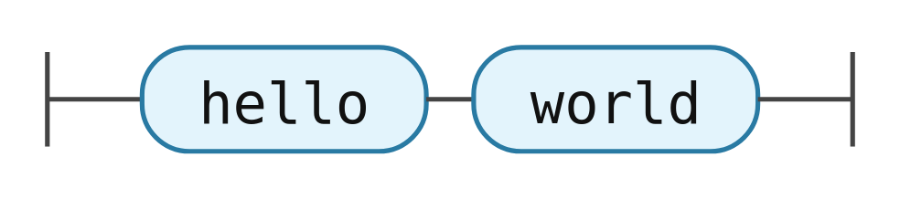

The strict minimum: a diagram written by hand using `@choo-choo/core`'s builder, rendered through the vanilla binding. No grammar, no parser.

## Install

```sh
pnpm init
pnpm add @choo-choo/core @choo-choo/vanilla
pnpm add -D vite
```

## Add a dev script

Open the generated `package.json` and add a `dev` script:

```json
{
  "scripts": {
    "dev": "vite"
  }
}
```

## Create `index.html`

At the project root:

```html
<!doctype html>
<html lang="en">
  <head>
    <meta charset="utf-8" />
    <title>choo-choo quickstart</title>
  </head>
  <body>
    <div id="diagram"></div>
    <script type="module" src="/src/main.ts"></script>
  </body>
</html>
```

## Create `src/main.ts`

```ts
import "@choo-choo/vanilla/styles.css";
import { diagram, sequence, terminal } from "@choo-choo/core";
import { mount } from "@choo-choo/vanilla";

mount(document.getElementById("diagram")!, {
  ir: diagram(sequence(terminal("hello"), terminal("world"))),
});
```

## Run

```sh
pnpm dev
```

Open `http://localhost:5173`.

You should see two terminals (`hello`, `world`) chained on a single track.


